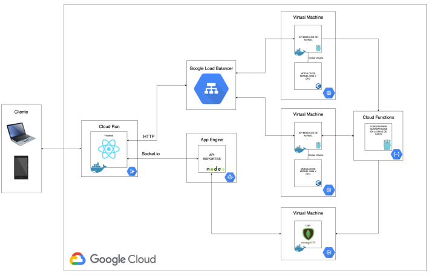

# Arquitectura Implementada

 
  

La aplicacion se construyo con una arquitectura basada en la nube (GCP), Haciendo uso de distintos servicios como Load Balancing, AppEngine, CloudRun, VMs y Cloud Functions se implemento
cada parte del proyecto. A continuacion se describe cada parte de la arquitectura:
# Frontend - Cloud Run

 
  

# API Reportes - App Engine

 
  

# APIs Modulos - VM 

 
  

Utilizacion el servicio de Compute Engine se crearon 2 maquinas virtuales (VM) las cada una contiene una copia de: 

- ### Modulos de Kernel RAM Y CPU (C)
>> RAM: Este es un modulo que al ser insertado permite ver la informacion actual del sistema respecto al consumo de memoria RAM

>> CPU: Este es un modulo que al ser insertado permite ver la informacion actual del sistema respecto a los procesos actuales.

- ### API Modulos (GO)
Esta API fue escrita en GO y dockerizada. Permite la comunicacion entre el sistema operativo de la virtual machine y la insercion de datos en la base de datos.  
Lee la informacion del modulo kernel solicitado con su respectivo endpoint (RAM o CPU) y envia una solicitud POST a la 
[CloudFunction](#guardado-de-Logs---cloud-functions) 
para guardar en la base de datos.

# Base de Datos - VM

 
  

En una tercera maquina virtual se instalo Docker y se levanto un contenedor de MongoDB la cual es la encargada de guardar los diferentes registros del proyecto. Logs, CPU y RAM
 
Este se comunica solamente con la [CloudFunction](#guardado-de-Logs---cloud-functions) 
para guardar datos y con la [Api Reportes](#API-Reportes---App-Engine) 
para obtener los datos guardados.

# Guardado de Logs - Cloud Functions

 
  

El servicio de Cloud Functions aloja una funcion en GO que permite enviar requests a la base de datos contenida en la [Virtual Machine de Mongo DB](#Base-de-Datos---VM) y asi guardar la informacion enviada desde alguna de las dos VM que contienen la [API Modulos](#APIs-Modulos---VM)

# Load Balancing 

 
  

El Balanceador se encarga de dividir el trafico proveniente de las solicitudes del [Frontend](#Frontend---Cloud-Run) a conveniencia para realizar las peticiones a cualquiera de las dos Maquinas virtuales que contienen la API de Modulos.

