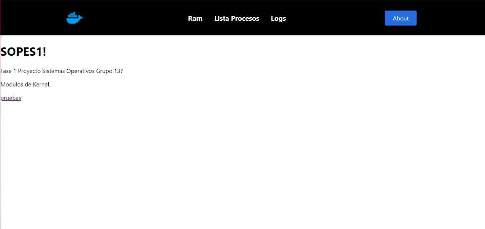
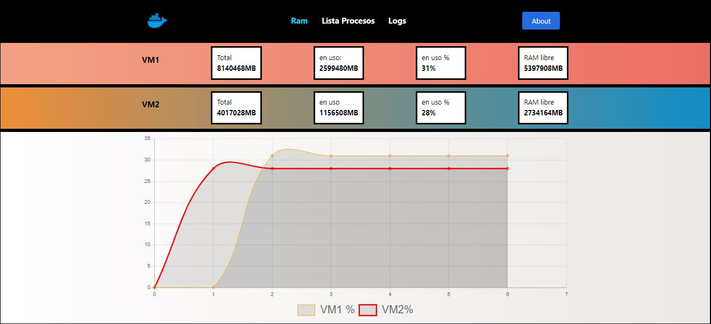
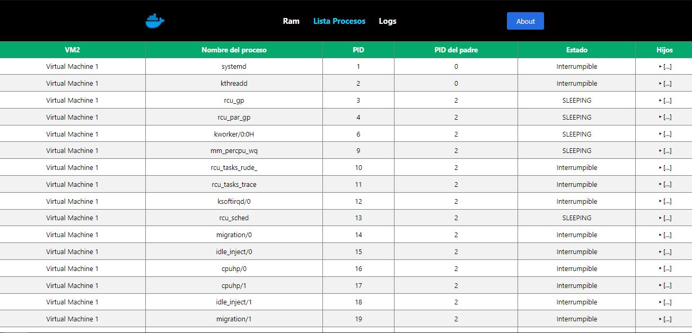
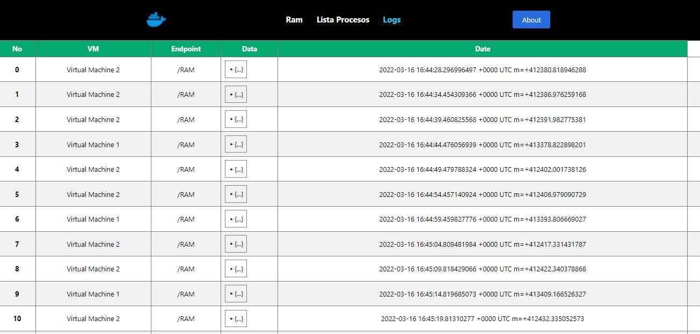

# **MANUAL DE USUARIO**

A continuación se detalla la forma correcta de usar la aplicación


## ***Prerequisitos***
- Navegador web.
- Cualquier sistema operativo.

Para poder hacer uso de la aplicación, se debe acceder al siguiente link:

```
https://frontendsopes-yjbbrfhtza-uc.a.run.app
```

Se mostrara la siguiente página de inicio:



Se podran observar las siguientes 3 opciones:

- Ram
- Lista Procesos
- Logs
---
## ***Ram***

Aqui se pueden observar los cambios de las dos maquinas virtuales en tiempo real, observando el total de ram,lo disponible, lo consumido y su porcentaje. Debajo se puede observar una grafica que compara el porcentaje consumido de cada maquina virtual. 



---
## ***Lista de Procesos***
Esta parte muestra un listado de los procesos que se estan ejecutando en cada maquina virtual en tiempo real, detallando el estado de cada uno de estos y si estos tienen hijos.



---
## ***Logs***
Aca se muestra un registro de cada operacion ejecutada ya sea de la ram o de la lista de procesos detallando la fecha y la información guardada en la base de datos.

